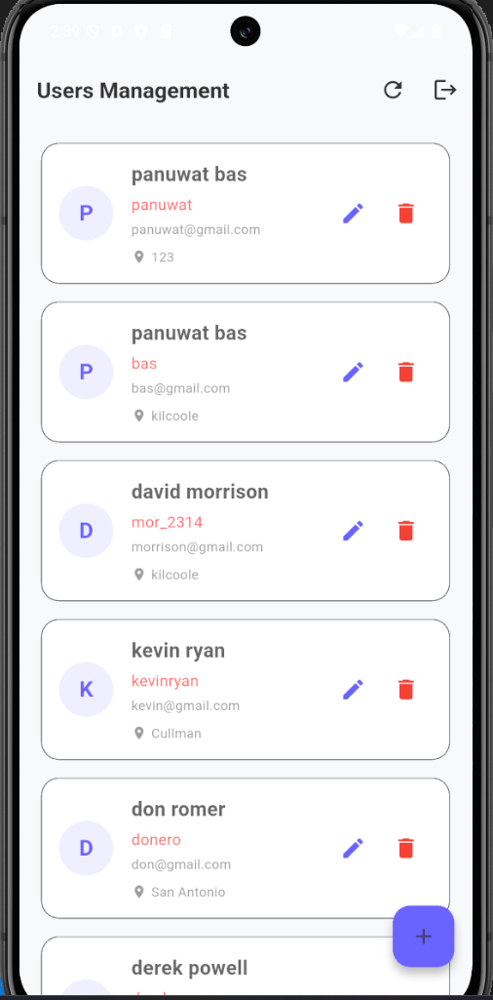
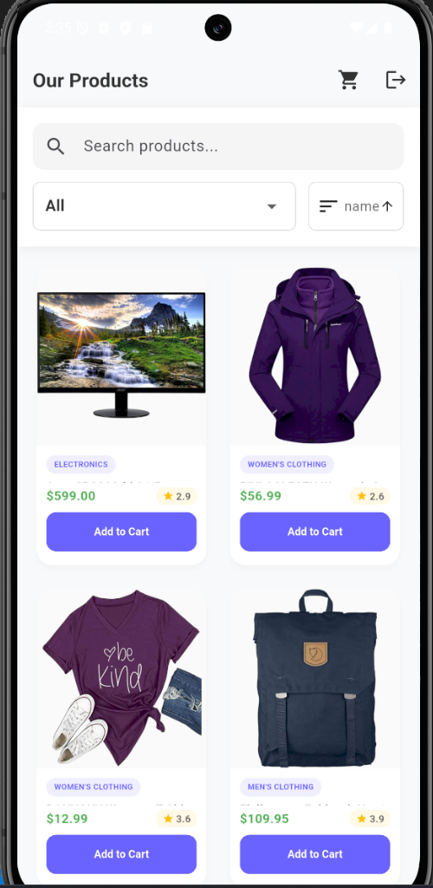
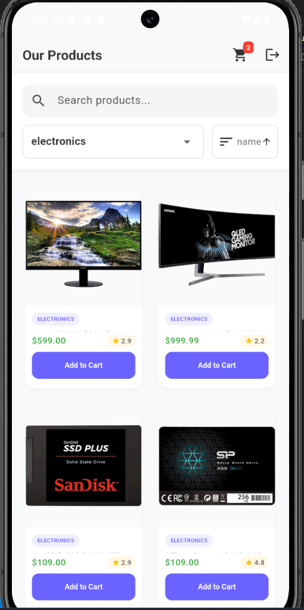
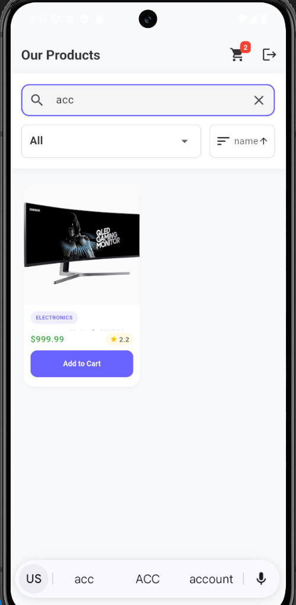
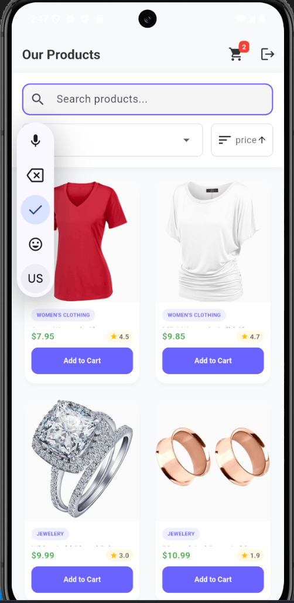
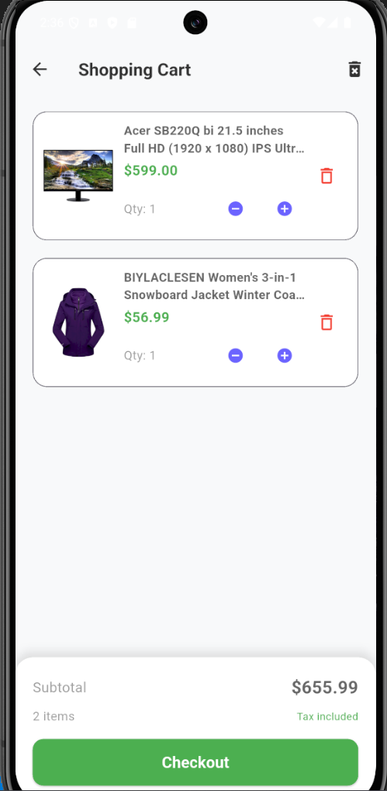

# lab 10
**จัดทำโดย:** panuwat takham 67543210044###3

## อธิบายโปรเจกต์ (Project Overview)
โปรเจกต์นี้เป็นแอปพลิเคชัน E-Commerce ที่พัฒนาด้วย **Flutter** โดยจำลองการดึงข้อมูลสินค้าจริงผ่าน API จาก `fakestoreapi.com` แอปพลิเคชันถูกออกแบบให้มี UI ที่ทันสมัยตามหลัก Material Design 3 และมีการจัดการ State Management ภายในแอปพลิเคชันด้วย **Provider** 

### ฟีเจอร์หลัก (Key Features)
### **Authentication:** ระบบจำลองการเข้าสู่ระบบผู้ใช้งาน (Login) 
### admin login
- 
### user login
- 

### **Product Listing:** แสดงรายการสินค้าในรูปแบบ Grid พร้อมแสดงรายละเอียดต่างๆ เช่น รูปภาพ, ชื่อ, หมวดหมู่, ราคา และคะแนน (Rating)
- 
### **Search & Filter:** ระบบค้นหาสินค้าจากชื่อ/รายละเอียด, ระบบกรองตามหมวดหมู่ (Category Filter)
- 
### **Sorting:** ระบบจัดเรียงสินค้ารองรับการเรียงตาม ชื่อ (Name), ราคา (Price) และ คะแนน (Rating)
- 

### **Shopping Cart:** ระบบตะกร้าสินค้าแบบ Local (CartProvider) สามารถกดหยิบสินค้าใส่ตะกร้าและนับจำนวนได้ทันที
- 

### **Animations:** แทรกแอนิเมชันตอนเปิดเข้าสู่หน้าแสดงสินค้าและการใช้วิดเจ็ต `TweenAnimationBuilder` เพื่อสร้าง Staggered Animation ให้กับการ์ดสินค้าตอนโหลด

### **State Management:** รวมศูนย์จัดการข้อมูลทั้งหมดด้วย `MultiProvider` ประกอบด้วย `UserProvider`, `ProductProvider` และ `CartProvider`

