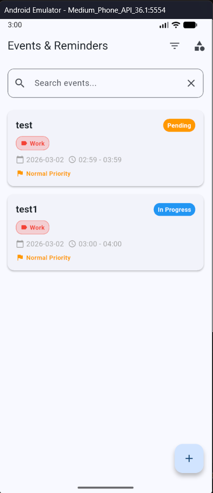
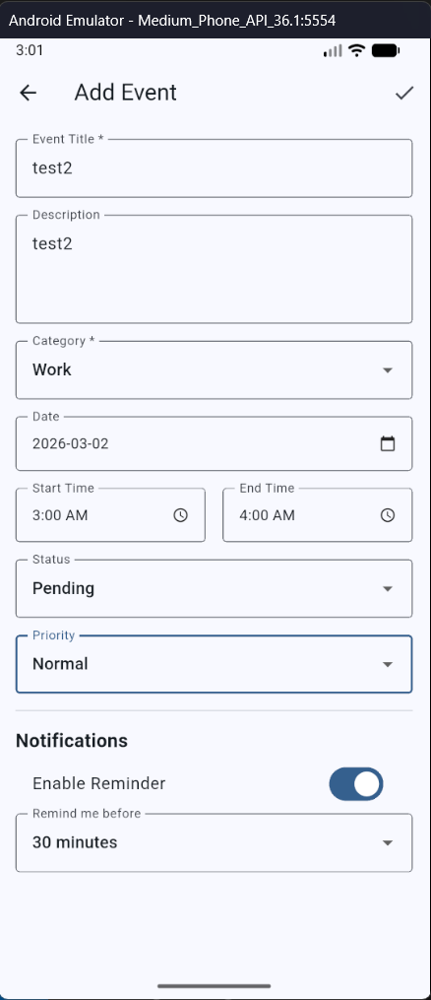
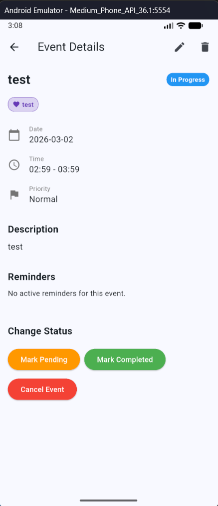
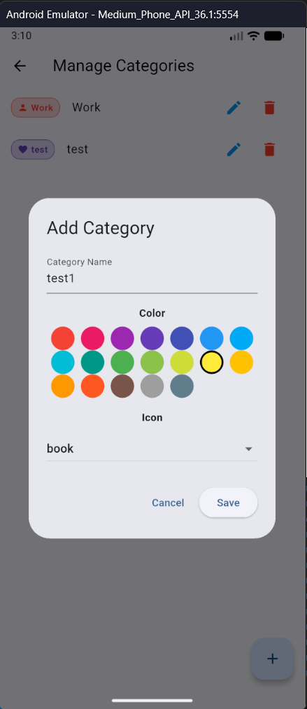
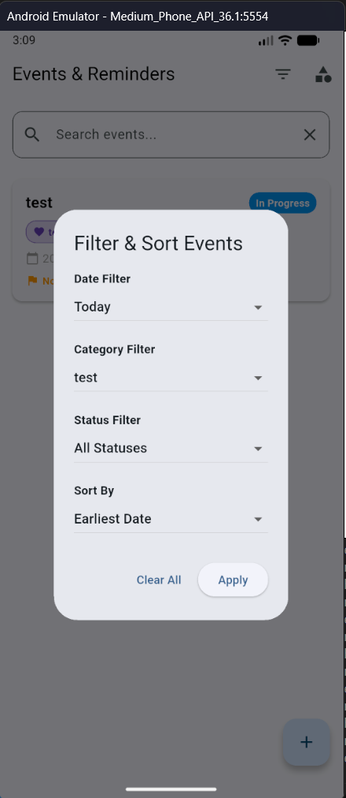
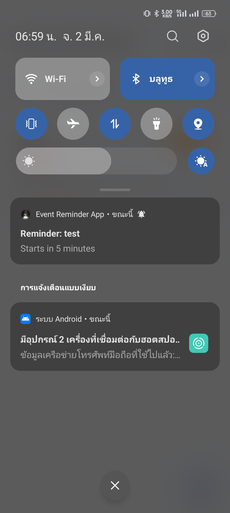

# Lab 11: Event & Reminder App

แอปพลิเคชันจัดการกิจกรรมและการแจ้งเตือน (Event & Reminder) แบบออฟไลน์  
พัฒนาสำหรับการทดลองปฏิบัติการ Lab 11 ด้วย **Flutter**, **Provider** และ **SQLite**

---

## 📌 ภาพรวมโครงการ

แอปพลิเคชันนี้ถูกพัฒนาเพื่อช่วยให้ผู้ใช้สามารถจัดการกิจกรรม ประเภทกิจกรรม และการแจ้งเตือนได้อย่างเป็นระบบ  
สามารถใช้งานแบบออฟไลน์ผ่าน SQLite และจัดการสถานะด้วย Provider

---

## ⭐ ฟีเจอร์หลัก (Features)

- **Offline First**  
  เก็บข้อมูลทั้งหมดภายในเครื่องด้วย SQLite (`sqflite`)

- **Categories Management**  
  เพิ่ม แก้ไข ลบ ประเภทกิจกรรม พร้อมกำหนดสีและไอคอน

- **Event Management**  
  จัดการกิจกรรม พร้อมข้อมูลสำคัญ เช่น ชื่อ, วันที่, เวลา, สถานะ และระดับความสำคัญ  
  มีระบบตรวจสอบเวลา (End Time > Start Time)

- **Advanced Filtering & Sorting**  
  - ค้นหาตามชื่อกิจกรรม  
  - กรองตามวันที่ / ประเภท / สถานะ  
  - จัดเรียงตามเวลาและการอัปเดต

- **State Management**  
  จัดการสถานะแอปด้วย `Provider`

- **Local Notification (Bonus)**  
  รองรับระบบแจ้งเตือนจริงด้วย `flutter_local_notifications`  
  และยกเลิกแจ้งเตือนอัตโนมัติเมื่อกิจกรรมถูก Cancelled หรือ Completed

---

## 🗄️ โครงสร้างฐานข้อมูล (Database Schema)

ระบบประกอบด้วย 3 ตารางหลัก ได้แก่ `categories`, `events` และ `reminders`

---

### 📌 ตาราง `categories` (ประเภทกิจกรรม)

| Field      | Type         | Description              |
| ---------- | ------------ | ------------------------ |
| id         | INTEGER (PK) | รหัสประเภท (Primary Key) |
| name       | TEXT         | ชื่อประเภทกิจกรรม        |
| color_hex  | TEXT         | รหัสสีแบบ Hex            |
| icon_key   | TEXT         | ชื่อไอคอน                |
| created_at | TEXT         | วันที่สร้าง              |
| updated_at | TEXT         | วันที่แก้ไขล่าสุด        |

---

### 📌 ตาราง `events` (กิจกรรม)

| Field       | Type         | Description                                  |
| ----------- | ------------ | -------------------------------------------- |
| id          | INTEGER (PK) | รหัสกิจกรรม (Primary Key)                   |
| title       | TEXT         | ชื่อกิจกรรม                                  |
| description | TEXT         | รายละเอียดกิจกรรม                           |
| category_id | INTEGER (FK) | อ้างอิงประเภท (categories.id)               |
| event_date  | TEXT         | วันที่จัดกิจกรรม (YYYY-MM-DD)               |
| start_time  | TEXT         | เวลาเริ่มกิจกรรม (HH:mm)                    |
| end_time    | TEXT         | เวลาสิ้นสุดกิจกรรม (HH:mm)                  |
| status      | TEXT         | สถานะกิจกรรม                                |
| priority    | INTEGER      | ระดับความสำคัญ (1=ต่ำ, 2=ปกติ, 3=สูง)        |
| created_at  | TEXT         | วันที่สร้าง                                 |
| updated_at  | TEXT         | วันที่แก้ไขล่าสุด                           |

---

### 📌 ตาราง `reminders` (การแจ้งเตือน)

| Field          | Type         | Description                              |
| -------------- | ------------ | ---------------------------------------- |
| id             | INTEGER (PK) | รหัสการแจ้งเตือน (Primary Key)          |
| event_id       | INTEGER (FK) | อ้างอิงกิจกรรม (events.id)              |
| minutes_before | INTEGER      | แจ้งเตือนล่วงหน้า (นาที)               |
| remind_at      | TEXT         | เวลาที่แจ้งเตือนจริง (Datetime)         |
| is_enabled     | INTEGER      | สถานะเปิด/ปิด (1 = เปิด, 0 = ปิด)        |
| created_at     | TEXT         | วันที่สร้าง                             |
| updated_at     | TEXT         | วันที่แก้ไขล่าสุด                       |

---

## 📂 โครงสร้างโปรเจกต์ (Project Structure)

```
lib/
├── main.dart
│
├── data/
│   ├── db/
│   │   └── database_helper.dart
│   │
│   ├── models/
│   │   ├── category.dart
│   │   ├── event.dart
│   │   └── reminder.dart
│   │
│   └── repositories/
│       ├── category_repository.dart
│       ├── event_repository.dart
│       └── reminder_repository.dart
│
├── services/
│   └── notification_service.dart
│
└── ui/
    ├── screens/
    │   ├── category_manage_screen.dart
    │   ├── event_detail_screen.dart
    │   ├── event_form_screen.dart
    │   └── home_screen.dart
    │
    ├── state/
    │   ├── category_provider.dart
    │   └── event_provider.dart
    │
    └── widgets/
        ├── category_badge.dart
        ├── event_card.dart
        └── status_chip.dart
```
## screenshot 5 images


## ▶️ วิธีการรันแอปพลิเคชัน (How to Run)

1. Clone Repository นี้
2. เปิดโปรเจกต์ด้วย Android Studio หรือ VS Code
3. ติดตั้ง Dependencies

   ```bash
   flutter pub get
   ```
4. เลือก Emulator / Device

5. รันแอป
   ```bash
   flutter run
   ```
---

## 📱 ภาพตัวอย่างแอปพลิเคชัน (Screenshots)

ตารางด้านล่างแสดงตัวอย่างหน้าต่างๆ พร้อมคำอธิบายและภาพประกอบ:

| # | หน้าจอ | คำอธิบาย | ภาพตัวอย่าง |
|---|--------|-----------|--------------|
| 1 | หน้าหลัก (Home) | แสดงรายการ Event ทั้งหมด พร้อมสถานะของแต่ละ Event และปฏิทินแบบรายสัปดาห์ |  |
| 2 | สร้างกิจกรรม (Create Event) | หน้าสำหรับสร้าง Event ใหม่ โดยสามารถระบุชื่อ, รายละเอียด, หมวดหมู่, วันเวลา, และตั้งค่าโหมดการแจ้งเตือนได้ |  |
| 3 | แก้ไขกิจกรรมและดูรายละเอียด (Edit & Event Details) | หน้าสำหรับดูรายละเอียดกิจกรรม, เปลี่ยนแปลงสถานะ (Pending/In Progress/Completed), และแก้ไขข้อมูล |  |
| 4 | จัดการหมวดหมู่ (Manage Categories) | หน้าจอสำหรับจัดการหมวดหมู่ (Category) โดยสามารถเพิ่ม, ลบ, แก้ไขชื่อ และกำหนดโค้ดสีเพื่อให้ค้นหาได้ง่ายขึ้น |  |
| 5 | ระบบกรองข้อมูล (Filter & Sort) | หน้าจอการกรอง Event ต่างๆ ตามหมวดหมู่และสถานะ เพื่อรองรับการค้นหาที่ละเอียดและตรงจุด |  |
| 6 | การแจ้งเตือน (Local Notification) | ภาพแสดงการทำงานของระบบ Local Notification ที่จะแจ้งเตือนผู้ใช้บนหน้าจอเมื่อถึงเวลาที่กำหนดไว้แบบออฟไลน์ |  |
