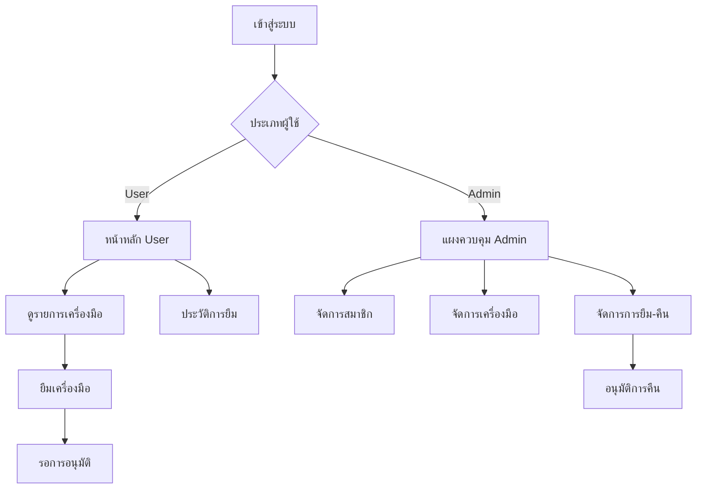

# 🏘️ Community Tool Sharing App
**แอปพลิเคชันแชร์เครื่องมือชุมชน**

## 📱 ชื่อแอป
**Community Tool Sharing** - แอปพลิเคชันสำหรับการยืม-คืนเครื่องมือในชุมชน

**android (แนะนำ)**
- [📦 ดาวน์โหลด Community Tools.apk ]( )

**หรือดาวน์โหลดจาก [Releases]()**

## 🎯 จุดประสงค์แอป

แอปพลิเคชันนี้พัฒนาขึ้นเพื่อช่วยให้ชุมชนสามารถแชร์และจัดการการยืม-คืนเครื่องมือต่างๆ ได้อย่างมีประสิทธิภาพ โดยมีจุดประสงค์หลักดังนี้:

- **ลดค่าใช้จ่าย**: สมาชิกชุมชนไม่ต้องซื้อเครื่องมือที่ใช้ไม่บ่อย
- **เพิ่มประสิทธิภาพ**: เครื่องมือได้รับการใช้งานอย่างคุ้มค่า
- **สร้างความสัมพันธ์**: ส่งเสริมการแชร์และช่วยเหลือกันในชุมชน
- **จัดการอย่างเป็นระบบ**: ติดตามการยืม-คืนได้อย่างชัดเจน

## 📋 รายละเอียดข้อมูลแอป

### 🔧 ฟีเจอร์หลัก

#### สำหรับสมาชิกชุมชน (Users)
- **📝 สมัครสมาชิก**: ลงทะเบียนด้วย Gmail และข้อมูลส่วนตัว
- **🔍 ค้นหาเครื่องมือ**: เรียกดูเครื่องมือที่มีให้ยืมตามหมวดหมู่
- **📱 ยืมเครื่องมือ**: เลือกจำนวนและกำหนดวันคืน
- **📊 ติดตามสถานะ**: ดูประวัติการยืมและสถานะปัจจุบัน
- **🔄 คืนเครื่องมือ**: แจ้งคืนเครื่องมือผ่านแอป

#### สำหรับผู้ดูแลระบบ (Admins)
- **👥 จัดการสมาชิก**: อนุมัติ/ปฏิเสธการสมัครสมาชิก
- **🛠️ จัดการเครื่องมือ**: เพิ่ม/แก้ไข/ลบข้อมูลเครื่องมือ
- **📋 จัดการการยืม-คืน**: อนุมัติการคืนและติดตามสถานะ
- **📈 รายงาน**: ดูสถิติการใช้งานและรายงานต่างๆ

### 🗂️ หมวดหมู่เครื่องมือ

- **🌿 เครื่องมือสวน**: เครื่องตัดหญ้า, เครื่องสูบน้ำ
- **🔨 เครื่องมือช่าง**: เครื่องเจาะไฟฟ้า, บันไดอลูมิเนียม
- **🪑 เฟอร์นิเจอร์**: โต๊ะพับ, เก้าอี้พลาสติก
- **🏕️ อุปกรณ์กลางแจ้ง**: เต็นท์, อุปกรณ์จัดงาน
- **🔌 อิเล็กทรอนิกส์**: เครื่องขยายเสียง, พัดลมอุตสาหกรรม
- **🛠️ เครื่องมือทั่วไป**: รถเข็น, อุปกรณ์อื่นๆ

### 💾 ระบบจัดเก็บข้อมูล

#### Local Database (SQLite)
- **Users**: ข้อมูลสมาชิก, สถานะการอนุมัติ
- **Equipment**: รายการเครื่องมือ, จำนวน, สถานะ
- **Transactions**: ประวัติการยืม-คืน
- **Admins**: ข้อมูลผู้ดูแลระบบ
- **App Config**: การตั้งค่าแอป

#### Cloud Storage (Google Sheets)
- **🔄 Bidirectional Sync**: ข้อมูลซิงค์สองทิศทาง
- **☁️ Backup**: สำรองข้อมูลบนคลาวด์
- **📊 Real-time**: ข้อมูลอัปเดตแบบเรียลไทม์
- **🔧 Conflict Resolution**: จัดการข้อมูลขัดแย้งอัตโนมัติ

### 🔐 ระบบความปลอดภัย

- **🔑 Authentication**: ระบบล็อกอินด้วย Gmail
- **👤 Role-based Access**: แยกสิทธิ์ User และ Admin
- **🛡️ Data Validation**: ตรวจสอบข้อมูลก่อนบันทึก
- **🔒 Secure Sync**: การซิงค์ข้อมูลแบบปลอดภัย

## 🖼️ ภาพประกอบ

 **Admin** และ **User** 

---

### 📱 หน้าจอสำหรับ Admin

| หน้าจอ | ประเภท | รายละเอียด | ภาพประกอบ |
| --- | --- | --- | --- |
| **หน้าจอแผงควบคุม Admin** | Admin | หน้าหลักสำหรับผู้ดูแลระบบ จัดการสมาชิก เครื่องมือ และรายการยืม-คืน |  |
| **หน้าจอจัดการสมาชิก** | Admin | อนุมัติ/ปฏิเสธการสมัครสมาชิกใหม่ |  |
| **หน้าจอจัดการเครื่องมือ** | Admin | เพิ่ม แก้ไข ลบข้อมูลเครื่องมือ |  |
| **หน้าจอจัดการการยืม-คืน** | Admin | อนุมัติการคืนและติดตามสถานะ |  |
| **หน้าจอเข้าสู่ระบบ** | Public | หน้าล็อกอินสำหรับสมาชิกและผู้ดูแล |  |

---

### 📱 หน้าจอสำหรับ User

| หน้าจอ | ประเภท | รายละเอียด | ภาพประกอบ |
| --- | --- | --- | --- |
| **หน้าจอหลัก User** | User | หน้าแรกของสมาชิก แสดงสถิติและเมนูหลัก |  |
| **หน้าจอรายการเครื่องมือ** | User | แสดงรายการเครื่องมือทั้งหมดที่มีให้ยืม |  |
| **หน้าจอยืมเครื่องมือ** | User | ฟอร์มสำหรับยืมเครื่องมือ เลือกจำนวนและวันคืน |  |
| **หน้าจอประวัติการยืม** | User | แสดงประวัติการยืม-คืนของสมาชิก |  |
| **หน้าจอสมัครสมาชิก** | Public | ฟอร์มลงทะเบียนสมาชิกใหม่ |  |

---

### 📊 แผนผังการทำงาน

### google sheet

### ความต้องการของระบบ
- **📱 Flutter SDK**: 3.0 หรือใหม่กว่า
- **🎯 Dart**: 3.0 หรือใหม่กว่า
- **📊 Google Sheets API**: สำหรับการซิงค์ข้อมูล
- **🔧 Google Apps Script**: สำหรับ backend
