# 🏘️ Community Tool Sharing App
**แอปพลิเคชันแชร์เครื่องมือชุมชน**

## 📱 ชื่อแอป
**Community Tool Sharing** - แอปพลิเคชันสำหรับการยืม-คืนเครื่องมือในชุมชน

**android (แนะนำ)**
- [📦 ดาวน์โหลด Community Tools.apk ](https://github.com/Panuwat-ta/engse608/releases/download/v1.0.0.0/app-release.apk)

**หรือดาวน์โหลดจาก [Releases](https://github.com/Panuwat-ta/engse608/releases/tag/v1.0.0.0)**

## 🎯 จุดประสงค์แอป

แอปพลิเคชันนี้พัฒนาขึ้นเพื่อช่วยให้ชุมชนสามารถแชร์และจัดการการยืม-คืนเครื่องมือต่างๆ ได้อย่างมีประสิทธิภาพ โดยมีจุดประสงค์หลักดังนี้:

- **ลดค่าใช้จ่าย**: สมาชิกชุมชนไม่ต้องซื้อเครื่องมือที่ใช้ไม่บ่อย
- **เพิ่มประสิทธิภาพ**: เครื่องมือได้รับการใช้งานอย่างคุ้มค่า
- **สร้างความสัมพันธ์**: ส่งเสริมการแชร์และช่วยเหลือกันในชุมชน
- **จัดการอย่างเป็นระบบ**: ติดตามการยืม-คืนได้อย่างชัดเจน

## 📋 รายละเอียดข้อมูลแอป

### 🔧 ฟีเจอร์หลัก

#### สำหรับสมาชิกชุมชน (Users)
- **📝 สมัครสมาชิก**: ลงทะเบียนด้วย Gmail และข้อมูลส่วนตัว
- **🔍 ค้นหาเครื่องมือ**: เรียกดูเครื่องมือที่มีให้ยืมตามหมวดหมู่
- **📱 ยืมเครื่องมือ**: เลือกจำนวนและกำหนดวันคืน
- **📊 ติดตามสถานะ**: ดูประวัติการยืมและสถานะปัจจุบัน
- **🔄 คืนเครื่องมือ**: แจ้งคืนเครื่องมือผ่านแอป

#### สำหรับผู้ดูแลระบบ (Admins)
- **👥 จัดการสมาชิก**: อนุมัติ/ปฏิเสธการสมัครสมาชิก
- **🛠️ จัดการเครื่องมือ**: เพิ่ม/แก้ไข/ลบข้อมูลเครื่องมือ
- **📋 จัดการการยืม-คืน**: อนุมัติการคืนและติดตามสถานะ
- **📈 รายงาน**: ดูสถิติการใช้งานและรายงานต่างๆ

### 🗂️ หมวดหมู่เครื่องมือ

- **🌿 เครื่องมือสวน**: เครื่องตัดหญ้า, เครื่องสูบน้ำ
- **🔨 เครื่องมือช่าง**: เครื่องเจาะไฟฟ้า, บันไดอลูมิเนียม
- **🪑 เฟอร์นิเจอร์**: โต๊ะพับ, เก้าอี้พลาสติก
- **🏕️ อุปกรณ์กลางแจ้ง**: เต็นท์, อุปกรณ์จัดงาน
- **🔌 อิเล็กทรอนิกส์**: เครื่องขยายเสียง, พัดลมอุตสาหกรรม
- **🛠️ เครื่องมือทั่วไป**: รถเข็น, อุปกรณ์อื่นๆ

### 💾 ระบบจัดเก็บข้อมูล

#### Local Database (SQLite)
- **Users**: ข้อมูลสมาชิก, สถานะการอนุมัติ
- **Equipment**: รายการเครื่องมือ, จำนวน, สถานะ
- **Transactions**: ประวัติการยืม-คืน
- **Admins**: ข้อมูลผู้ดูแลระบบ
- **App Config**: การตั้งค่าแอป

#### Cloud Storage (Google Sheets)
- **🔄 Bidirectional Sync**: ข้อมูลซิงค์สองทิศทาง
- **☁️ Backup**: สำรองข้อมูลบนคลาวด์
- **📊 Real-time**: ข้อมูลอัปเดตแบบเรียลไทม์
- **🔧 Conflict Resolution**: จัดการข้อมูลขัดแย้งอัตโนมัติ

### 🔐 ระบบความปลอดภัย

- **🔑 Authentication**: ระบบล็อกอินด้วย Gmail
- **👤 Role-based Access**: แยกสิทธิ์ User และ Admin
- **🛡️ Data Validation**: ตรวจสอบข้อมูลก่อนบันทึก
- **🔒 Secure Sync**: การซิงค์ข้อมูลแบบปลอดภัย

## 🖼️ ภาพประกอบ

 **Admin** และ **User** 

---

### 📱 หน้าจอสำหรับ Admin

| หน้าจอ | ประเภท | รายละเอียด | ภาพประกอบ |
| --- | --- | --- | --- |
| **หน้าจอแผงควบคุม Admin** | Admin | หน้าหลักสำหรับผู้ดูแลระบบ จัดการสมาชิก เครื่องมือ และรายการยืม-คืน | 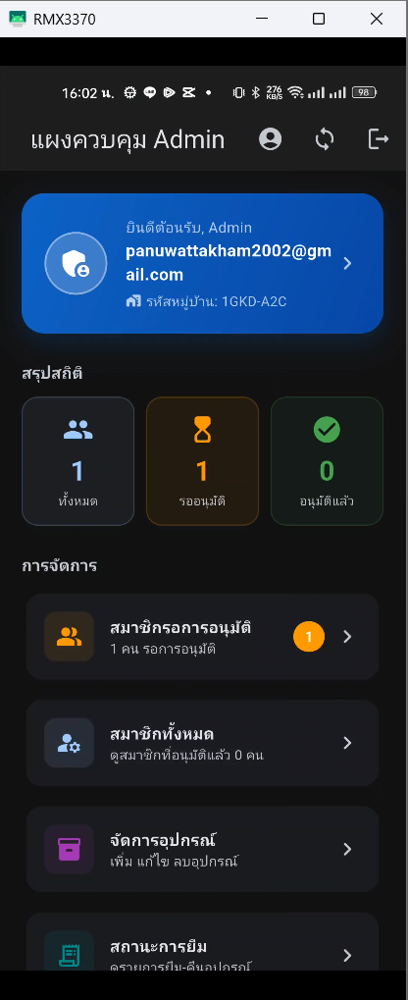 |
| **หน้าจอจัดการสมัครสมาชิก** | Admin | อนุมัติ/ปฏิเสธการสมัครสมาชิกใหม่ | 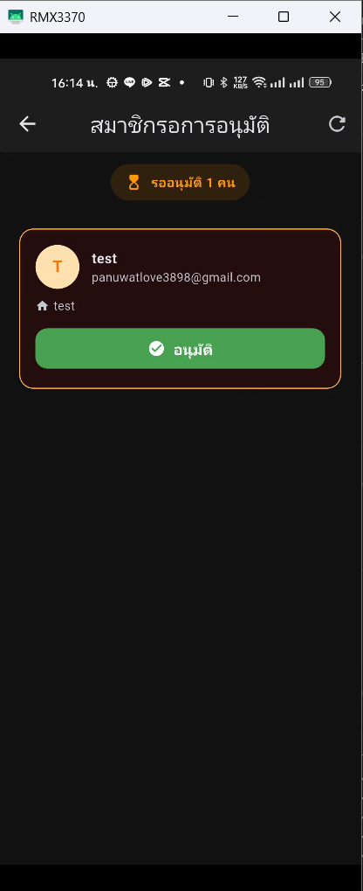 |
| **หน้าจอจัดการสมาชิก** | Admin | ดู/ลบสมาชิก | 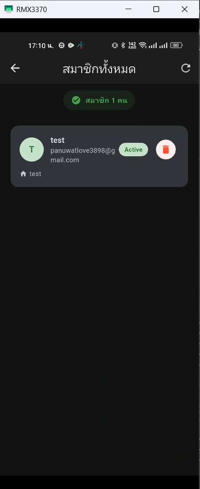 |
| **หน้าจอจัดการเครื่องมือ** | Admin | เพิ่ม แก้ไข ลบข้อมูลเครื่องมือ | 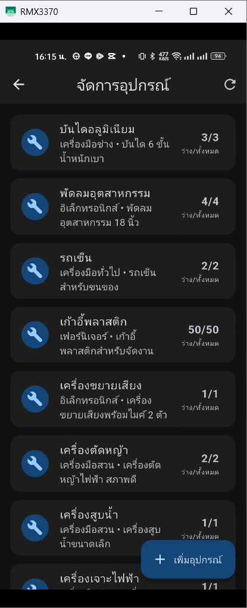 |
| **หน้าจอจัดการการยืม-คืน** | Admin | อนุมัติการคืนและติดตามสถานะ | 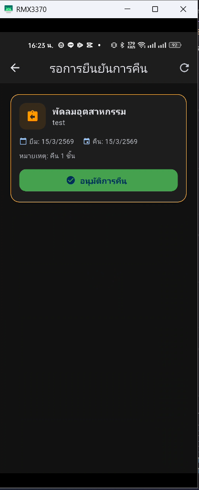 |
| **หน้าจอเข้าสู่ระบบ** | Public | หน้าล็อกอินสำหรับสมาชิกและผู้ดูแล | 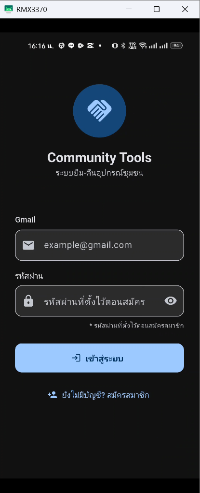 |

---

### 📱 หน้าจอสำหรับ User

| หน้าจอ | ประเภท | รายละเอียด | ภาพประกอบ |
| --- | --- | --- | --- |
| **หน้าจอหลัก User** | User | หน้าแรกของสมาชิก แสดงสถิติและเมนูหลัก | 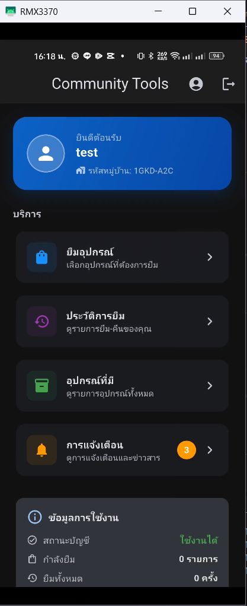 |
| **หน้าจอรายการเครื่องมือ** | User | แสดงรายการเครื่องมือทั้งหมดที่มีให้ยืม | 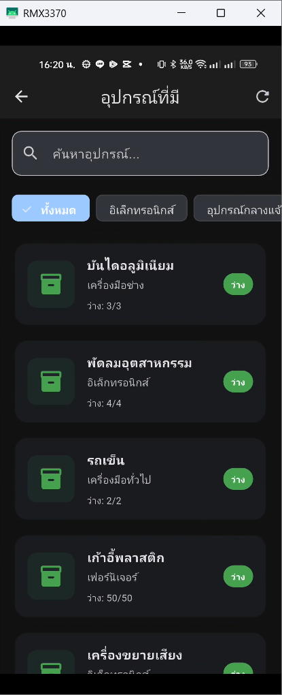 |
| **หน้าจอยืมเครื่องมือ** | User | ฟอร์มสำหรับยืมเครื่องมือ เลือกจำนวนและวันคืน | 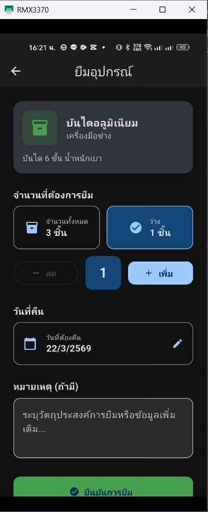 |
| **หน้าจอประวัติการยืม** | User | แสดงประวัติการยืม-คืนของสมาชิก | 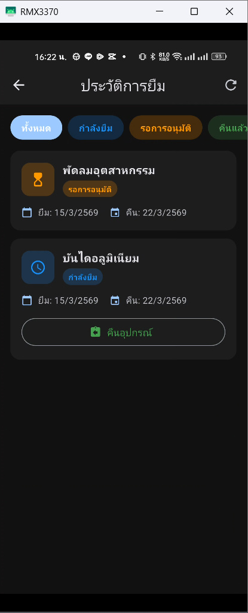 |
| **หน้าจอสมัครสมาชิก** | Public | ฟอร์มลงทะเบียนสมาชิกใหม่ | 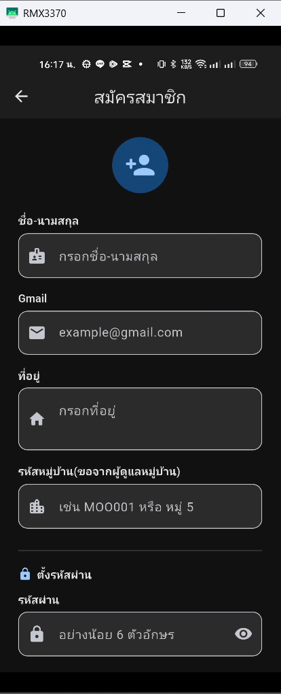 |

---

### 📊 แผนผังการทำงาน

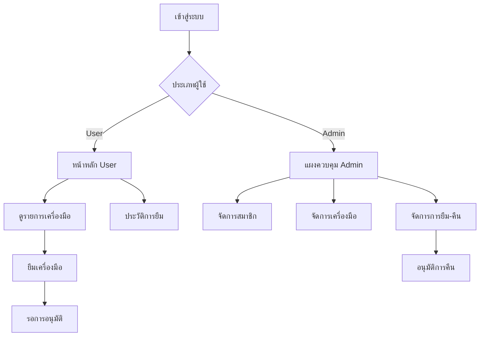


### google sheet
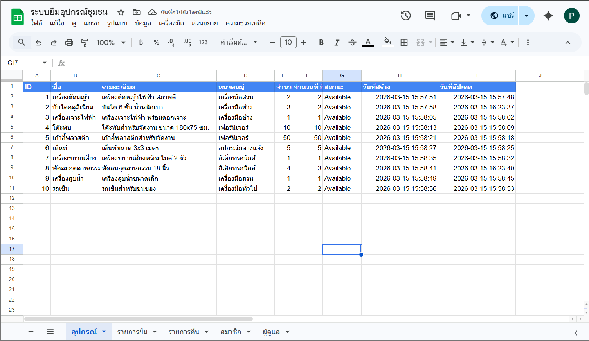


### ความต้องการของระบบ
- **📱 Flutter SDK**: 3.0 หรือใหม่กว่า
- **🎯 Dart**: 3.0 หรือใหม่กว่า
- **📊 Google Sheets API**: สำหรับการซิงค์ข้อมูล
- **🔧 Google Apps Script**: สำหรับ backend
- **📍 GPS/Location Services**: สำหรับบันทึกตำแหน่งสมาชิก
- **📶 Internet Connection**: สำหรับซิงค์ข้อมูลกับ Google Sheets

### 🔐 สิทธิ์ที่แอปขอ (Android Permissions)

| สิทธิ์ | จำเป็น | วัตถุประสงค์ |
|--------|--------|-------------|
| **INTERNET** | ✅ จำเป็น | เชื่อมต่อ Google Sheets API และ Apps Script |
| **ACCESS_NETWORK_STATE** | ✅ จำเป็น | ตรวจสอบสถานะการเชื่อมต่ออินเทอร์เน็ต |
| **ACCESS_WIFI_STATE** | ✅ จำเป็น | ตรวจสอบสถานะ WiFi สำหรับการซิงค์ |
| **ACCESS_FINE_LOCATION** | ✅ จำเป็น | ดึงพิกัด GPS ตอนสมัครสมาชิก |
| **ACCESS_COARSE_LOCATION** | ✅ จำเป็น | ดึงตำแหน่งโดยประมาณ |
| **CAMERA** | 🔶 ทางเลือก | ถ่ายรูปเครื่องมือ (ถ้ามีฟีเจอร์) |
| **READ_EXTERNAL_STORAGE** | 🔶 ทางเลือก | อ่านรูปภาพจากเครื่อง |
| **READ_MEDIA_IMAGES** | 🔶 ทางเลือก | อ่านรูปภาพ (Android 13+) |
| **POST_NOTIFICATIONS** | 🔶 ทางเลือก | แจ้งเตือนการยืม-คืน |
| **VIBRATE** | 🔶 ทางเลือก | การสั่นเมื่อมีการแจ้งเตือน |
| **WAKE_LOCK** | 🔶 ทางเลือก | ทำงานในพื้นหลังสำหรับ sync |

### 📋 คำอธิบายสิทธิ์

#### 🌐 **สิทธิ์เครือข่าย**
- **INTERNET**: จำเป็นสำหรับการส่งข้อมูลไปยัง Google Apps Script และ Google Sheets
- **ACCESS_NETWORK_STATE**: ตรวจสอบว่ามีการเชื่อมต่ออินเทอร์เน็ตหรือไม่ก่อนทำการซิงค์
- **ACCESS_WIFI_STATE**: ตรวจสอบสถานะ WiFi เพื่อประหยัดข้อมูลมือถือ

#### 📍 **สิทธิ์ตำแหน่ง**
- **ACCESS_FINE_LOCATION**: ใช้สำหรับบันทึกพิกัด GPS ของสมาชิกตอนสมัคร
- **ACCESS_COARSE_LOCATION**: ใช้เป็นทางเลือกเมื่อ GPS ไม่พร้อมใช้งาน

#### 📷 **สิทธิ์สื่อ (ทางเลือก)**
- **CAMERA**: สำหรับถ่ายรูปเครื่องมือเมื่อเพิ่มรายการใหม่
- **READ_EXTERNAL_STORAGE**: อ่านรูปภาพจากแกลเลอรี่
- **READ_MEDIA_IMAGES**: สำหรับ Android 13+ ในการเข้าถึงรูปภาพ

#### 🔔 **สิทธิ์การแจ้งเตือน (ทางเลือก)**
- **POST_NOTIFICATIONS**: แจ้งเตือนเมื่อมีการอนุมัติ/ปฏิเสธการยืม-คืน
- **VIBRATE**: การสั่นเมื่อมีการแจ้งเตือนสำคัญ
- **WAKE_LOCK**: ให้แอปทำงานในพื้นหลังสำหรับการซิงค์ข้อมูลอัตโนมัติ

### 🚀 ขั้นตอนการติดตั้ง

1. **Clone Repository**
   ```bash
   git clone [repository-url]
   cd community-tool-sharing
   ```

2. **ติดตั้ง Dependencies**
   ```bash
   flutter pub get
   ```

3. **ตั้งค่า Google Sheets**
   - สร้าง Google Sheets ใหม่
   - คัดลอกโค้ดจาก `complete_gas_code.js` ไปยัง Apps Script
   - Deploy เป็น Web App

4. **กำหนดค่า URL**
   - ใส่ Web App URL ในแอป
   - ทดสอบการเชื่อมต่อ

5. **รันแอป**
   ```bash
   flutter run
   ```

### 📱 การอนุญาตสิทธิ์เมื่อใช้งานครั้งแรก

เมื่อเปิดแอปครั้งแรก ระบบจะขอสิทธิ์ดังนี้:

1. **📍 สิทธิ์ตำแหน่ง**: 
   - เลือก "อนุญาตขณะใช้แอป" สำหรับการบันทึกพิกัดตอนสมัครสมาชิก
   - จำเป็นสำหรับการยืนยันตำแหน่งในชุมชน

2. **🔔 การแจ้งเตือน**: 
   - เลือก "อนุญาต" เพื่อรับการแจ้งเตือนเมื่อมีการอนุมัติการยืม-คืน
   - สามารถปิดได้ในภายหลังผ่านการตั้งค่าแอป

3. **📷 กล้องและรูปภาพ** (ถ้ามีฟีเจอร์):
   - เลือก "อนุญาต" เพื่อถ่ายรูปหรือเลือกรูปเครื่องมือ
   - ไม่จำเป็นสำหรับการใช้งานพื้นฐาน

### ⚠️ หมายเหตุสำคัญ
- แอปจะทำงานได้แม้ไม่อนุญาตสิทธิ์ทางเลือก
- สิทธิ์ตำแหน่งจำเป็นสำหรับการสมัครสมาชิกเท่านั้น
- สามารถเปลี่ยนแปลงสิทธิ์ได้ในการตั้งค่าของระบบ Android

## 🔧 เทคโนโลยีที่ใช้

- **Frontend**: Flutter/Dart
- **Local Database**: SQLite
- **Cloud Storage**: Google Sheets
- **Backend**: Google Apps Script
- **Authentication**: Gmail OAuth
- **Sync**: Bidirectional with conflict resolution
- **Location**: GPS/Network Location Provider
- **Notifications**: Firebase Cloud Messaging (FCM)

## 🛡️ ความปลอดภัยและความเป็นส่วนตัว

### 🔒 การจัดการข้อมูล
- **ข้อมูลส่วนบุคคล**: เก็บเฉพาะข้อมูลที่จำเป็นสำหรับการใช้งาน
- **พิกัด GPS**: ใช้เฉพาะตอนสมัครสมาชิกเพื่อยืนยันตำแหน่งในชุมชน
- **การเข้ารหัส**: ข้อมูลสำคัญถูกเข้ารหัสก่อนส่งไปยัง Google Sheets

### 🔐 การควบคุมสิทธิ์
- **สิทธิ์แบบขั้นต่ำ**: ขอเฉพาะสิทธิ์ที่จำเป็นสำหรับการทำงาน
- **สิทธิ์ทางเลือก**: ผู้ใช้สามารถปฏิเสธสิทธิ์ที่ไม่จำเป็นได้
- **การยกเลิกสิทธิ์**: สามารถเปลี่ยนแปลงสิทธิ์ได้ตลอดเวลาในการตั้งค่า Android

## 📞 การติดต่อและสนับสนุน

หากมีคำถามหรือต้องการความช่วยเหลือ สามารถติดต่อได้ที่:
- **📧 Email**: [your-email@example.com]
- **📱 Line**: [your-line-id]
- **🌐 Website**: [your-website.com]

## 📄 License

MIT License - ดูรายละเอียดใน [LICENSE](LICENSE) file

---

**พัฒนาด้วย ❤️ เพื่อชุมชนไทย**
